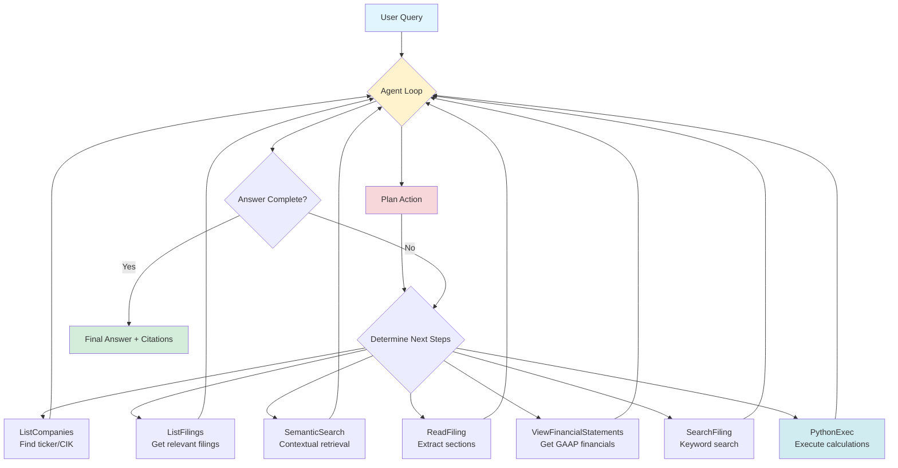

# Intellifin Agent

*Autonomous Financial Modeling and Analysis over SEC Filings*

[](https://www.python.org/downloads/)
[](LICENSE)

> **92% accuracy on the Finance Agent validation set** — a 37-point improvement over the previous state of the art (55%) using the *same models*.
> Achieved purely through cleaner data, structured retrieval, and executable reasoning.

---

## Overview

**Intellifin** is an autonomous agent that performs end-to-end financial reasoning:
it searches SEC filings, extracts metrics, executes calculations in Python, and produces sourced analytical answers.

The performance leap didn't come from a bigger model — it came from *better infrastructure*.
Finance data is inherently mixed-format: structured statements and unstructured commentary.
We built a retrieval and reasoning stack that lets an LLM treat that data like a living database.

### Key Features

- **Unified financial document index** across 10-K, 10-Q, 8-K, transcripts, and proxy statements
- **Contextual embeddings** with metadata (company, date, section) baked in at embed-time
- **Markdown-first parsing** that preserves table structure and eliminates XBRL noise
- **Agentic execution loop** with dynamic planning, targeted retrieval, and Python computation
- **Full auditability** — every calculation is reproducible, every source is cited

---

## 1. The Intellifin Index

A unified, high-quality search index for unstructured financial data.
It integrates every class of corporate disclosure into one coherent retrieval layer:

- SEC filings (10-K, 10-Q, 8-K, DEF 14A)
- Notes to financial statements
- Press releases and investor presentations
- Merger agreements and certificates of designation
- Underwriting agreements and material contracts
- Management commentary and earnings call transcripts

Each section is embedded **with context at embed-time**:
company, filing date, report date, and section title (e.g., *Note 7 – Geographic Revenue*).
This allows natural queries such as:

> "2025 financial statement note on geographic breakdown for AAPL"

to resolve correctly even without explicit metadata filters.

**Technical specs:**
- Chunk size ≈ 1024 tokens
- Embeddings via **Voyage contextual models**
- Reranking with cross-encoder relevance scoring
- Coverage: ~50 companies × multiple years ≈ 50-100M embedded tokens

---

## 2. Clean Data vs. Broken Data

The original **Finance Agent** benchmark fed LLMs raw HTML from EDGAR filings —
complete with XBRL tags and inline styling.
Tables were mangled into unreadable text, making it nearly impossible for a model to identify numeric structure.

### Example — Original Benchmark Input

```html
<table border="0" cellpadding="0" cellspacing="0">
<tr><td><b>Net Revenue</b></td><td>2023</td><td>2022</td></tr>
<tr><td><a href="#us-gaap_RevenueFromContractWithCustomerExcludingAssessedTax">
us-gaap:RevenueFromContractWithCustomerExcludingAssessedTax</a></td>
<td>$53,423</td><td>$48,858</td></tr>
</table>
<p>ITEM 7. Management's Discussion and Analysis of Financial Condition and Results of Operations (MD&amp;A)</p>
```

### Intellifin Markdown Conversion

```markdown
### Consolidated Statements of Operations
| (USD millions) | 2023 | 2022 |
|----------------|------:|------:|
| **Net Revenue** | 53,423 | 48,858 |

**MD&A – Discussion:**
Management attributes the 9.4% YoY increase primarily to higher subscription volumes and pricing.
```

The difference is self-explanatory: Intellifin's structured Markdown preserves layout and semantics,
eliminating thousands of irrelevant tokens per filing and making the text interpretable by both LLMs and humans.

---

## 3. Agentic Reasoning Loop

Each query executes through a closed-loop sequence of **plan → search → read → compute → synthesize**.

The agent operates autonomously with access to 8 specialized actions, dynamically planning and executing multi-step workflows:



### Agent Execution Flow

**Phase 1: Context Setup (1-2 turns)**
1. `ListCompanies` - Resolve company names to tickers/CIKs
2. `ListFilings` - Identify relevant 10-K, 10-Q, 8-K filings by date range

**Phase 2: Retrieval (1-2 turns)**
3. `SemanticSearch` - Query across all indexed documents with contextual embeddings
4. `ReadFiling` - Extract specific sections (MD&A, Risk Factors, Notes)
5. `ViewFinancialStatements` - Pull standardized GAAP statements

**Phase 3: Computation (1-2 turns)**
6. `PythonExec` - Execute calculations in isolated sandbox (CAGR, margins, ratios)

**Phase 4: Synthesis (1 turn)**
7. Generate answer with full citations and source links

**Performance:**
- Average: 7.7 turns per query
- Input: 124k tokens / Output: 5k tokens
- Cost: ≈$0.10 per query (GPT-4o)
- Runtime: ≈140s

All calculations run inside an isolated Python sandbox — reproducible, auditable, and safe.

---

## 4. Benchmark Results — Finance Agent

| Model                                 | Accuracy | Avg Cost/Query | Avg Time (s) |
|:--------------------------------------|:--------:|:--------------:|:------------:|
| **GPT-5 high (Intellifin)**           | **92%**  |     $0.10      |     137      |
| **Claude 4.5 Sonnet (Intellifin)**    |   82%    |     $0.23      |      50      |
| **Claude 4.5 Haiku (Intellifin)**     |   82%    |     $0.10      |      53      |
| **Claude 4.5 Sonnet (Finance Agent)** |   55%    |     $1.41      |     130      |

### Why the +37 point improvement at 1/6th the cost

The jump comes from *infrastructure, not inference*:

1. **Structured Markdown filings** – high-fidelity tables, stripped XBRL tags
2. **Contextual retrieval** – each section embedded with full provenance
3. **Agentic execution** – dynamic planning + targeted search + Python computation

**The efficiency gain is dramatic:**
With the same Claude 4.5 Sonnet model, agentic retrieval achieves 82% accuracy at **$0.23 per query** vs 55% accuracy at **$1.41 per query** in the original benchmark. That's a **27-point accuracy improvement** while reducing cost by **84%**.

Instead of stuffing entire filings into context windows, the agent surgically retrieves only what's needed — making every token count.

---

## 5. Validation-Set Corrections

We identified **four factually incorrect "ground-truth" answers** in the public Finance Agent validation set and updated **16+ outdated or ambiguous questions**.
All corrections are fully documented in `datasets/finance_agent_public_validation.yaml` with:
- Original vs. corrected answers
- Issue type classification
- SEC filing citations
- Revision dates

### Material Errors Corrected

| Issue                            | Original Error                | Corrected Value                                      | Citation |
|----------------------------------|-------------------------------|------------------------------------------------------|----------|
| **TKO / Endeavor acquisition**   | $3.25B                        | $3.30B (includes $50M purchase price adjustment)     | [8-K Exhibit 99.1](https://www.sec.gov/Archives/edgar/data/1973266/000095017025067002/tko-ex99_1.htm) |
| **Zillow FCF margin (2022)**     | 24.8%                         | 224% (GAAP CFO includes Zillow Offers inventory liquidation $4.5B) | [10-K Cash Flows](https://www.sec.gov/cgi-bin/viewer?action=view&cik=1617640&accession_number=0001617640-25-000016&xbrl_type=v#) |
| **KKR Series D preferred stock** | "No common dividends allowed" | Common dividends permitted if preferred dividends current | [Certificate of Designations](https://www.sec.gov/Archives/edgar/data/1404912/000114036125007608/ny20042797x5_ex3-1.htm) |
| **Delta Airlines EPS guidance**  | "YoY growth %" | "Absolute dollar range (e.g., $6.00-$7.00)" | [8-K Sept 2024](https://www.sec.gov/Archives/edgar/data/27904/000002790425000018/deltaairlinesannouncessept.htm) |

### Categories of Corrections

- **Incorrect answers** (4): Material factual errors in ground truth
- **Outdated questions** (6): Events resolved differently than original (e.g., US Steel merger completed)
- **Ambiguous questions** (3): Underspecified or requiring clarification
- **Added precision** (4): Increased decimal places to satisfy strict grading
- **Structurally invalid** (2): Questions with undefined operations (e.g., % change on negative net income)

**Example correction from validation set:**

```yaml
# Question 008 - TKO Endeavor acquisition (INCORRECT ANSWER)
- id: "008"
  question: "What was the total consideration cost TKO paid to acquired Endeavor assets measured at transaction close?"
  ticker: "TKO, EDR"
  ground_truth: |
    $3.30 Billion
  original_ground_truth: |
    $3.25 Billion
  issue_type: "incorrect_answer"
  issue_notes: "Original answer missed $50M purchase price adjustment, underreporting total consideration by $50M"
  revision_date: "2025-10-14"
```

These corrections ensure the benchmark tests *agent accuracy*, not tolerance for bad ground truth.

**For detailed justification of all corrections, see [CORRECTIONS.md](CORRECTIONS.md).**

---

## 6. Evaluation Protocol

Evaluation uses an independent LLM grader enforcing factual equivalence with minor rounding tolerance.
All 50 questions, answers, and grades are logged for full reproducibility.

```python
class Evaluation(BaseModel):
    answer_correct: Literal['Yes', 'No']
    notes: str
```

Each response is checked for numerical and textual correctness; borderline cases (e.g., 46% vs 45.6%) are accepted with appropriate tolerance.

---

## Quick Start

### Installation

```bash
# Clone the repository
git clone https://github.com/lucasastorian/intellifin-agent.git
cd intellifin-agent

# Install dependencies
pip install -r requirements.txt

# Set up API keys (required)
export OPENAI_API_KEY=your_key_here
export VOYAGE_API_KEY=your_key_here

# Optional: for earnings transcripts via FMP
export FMP_API_KEY=your_key_here

# Set up user agent for SEC EDGAR (required by SEC)
export USER_AGENT="Your Name your.email@example.com"
```

### Basic Usage

**Ask any financial question:**

```bash
# Default question (Boeing's effective tax rate in 2024)
python main.py

# Custom question
python main.py --query "What was Palantir's revenue CAGR from 2021 to 2024?"

# Specify model and reasoning effort
python main.py \
  --query "Calculate Netflix's FCF margin trend over 3 years" \
  --model gpt-5 \
  --reasoning-effort high
```

**Available models:**
- `gpt-5`, `gpt-5-mini` (OpenAI)
- `claude-sonnet-4-5`, `claude-haiku-4-5`, `claude-opus-4-1` (Anthropic)
- `gemini-2.5-pro`, `gemini-2.5-flash` (Google)
- `grok-4` (xAI)

### Running Evaluations

**Reproduce the benchmark results:**

```bash
# Run full 50-question validation set with GPT-4o
python run_eval.py --model gpt-5 --reasoning-effort medium

# Run with Claude 3.5 Sonnet
python run_eval.py --model claude-sonnet-4-5 --reasoning-effort medium

# Run in parallel for faster execution (less verbose output)
python run_eval.py --model gpt-5 --parallel

# Run first 10 questions only (for testing)
python run_eval.py --limit 10

# Results will be saved to eval_results/run_YYYY-MM-DD_HH-MM-SS/
```

**Evaluation modes:**
- `standard` (default) - Uses updated questions & corrected answers
- `strict` - Same as standard but with stricter numerical tolerances
- `original` - Uses original Finance Agent questions/answers (for comparison)
- `updated` - Uses updated questions with corrected answers

Each run produces:
- `results.json` - Full trace of each question (agent actions, retrieved context, calculations)
- `report.md` - Summary with accuracy, cost, timing, and per-question results

---

## Architecture

### Core Components

**`agent/`** - Agentic orchestration and tool execution
- `agent.py` - Main agent loop (plan → retrieve → compute → synthesize)
- `system_prompt.py` - Reasoning instructions and workflow guidance
- `actions/` - Available tools:
  - `ListCompaniesAction` - Search companies by name → ticker
  - `ListFilingsAction` - List filings by date range and type
  - `ReadFilingAction` - Read specific sections of filings
  - `ViewFinancialStatementsAction` - Extract standardized financial statements
  - `SemanticSearchAction` - Contextual search across all documents
  - `SearchFilingAction` - Keyword search within specific filing
  - `PythonExecAction` - Execute calculations in isolated sandbox
  - `PlanAction` - Generate execution plan

**`data/`** - Document storage and indexing
- `intellifin.db` - SQLite database with filings metadata
- `embeddings/` - Voyage contextual embeddings + reranker cache
- `filings/` - Cached SEC documents in clean Markdown

**`evals/`** - Benchmark infrastructure
- `eval_runner.py` - Parallel/serial test execution
- `answer_evaluator.py` - LLM-as-judge with tolerance for rounding
- `eval_dataset.py` - Dataset loader with correction tracking

**`datasets/`** - Evaluation data
- `finance_agent_public_validation.yaml` - 50 questions with documented corrections

**`utils/`** - Infrastructure
- `sec_api.py` - SEC EDGAR fetcher (rate-limited, cached)
- `markdown_converter.py` - HTML → clean Markdown with table preservation
- `print_messages.py` - Pretty-print agent execution trace

**Entry points:**
- `main.py` - Ask individual questions
- `run_eval.py` - Run full benchmark evaluation

---

## Caveats and Limitations

1. **Not financial advice** - This is a research tool. All outputs should be verified independently.

2. **Data freshness** - Filings are cached; updates require manual refresh. Not suitable for real-time trading.

3. **Coverage limits** - Currently optimized for ~50 well-known companies. Smaller caps may have sparse data.

4. **Calculation assumptions** - All metrics use GAAP definitions unless otherwise stated. Non-GAAP reconciliations may differ.

5. **Benchmark scope** - 92% accuracy is on a 50-question validation set. Performance on out-of-distribution queries may vary.

6. **Cost considerations** - At $0.10/query with GPT-4o, bulk analysis can get expensive. Consider caching strategies.

---

## Why It Matters

Financial analysis requires all three pillars simultaneously:

1. **Knowledge** – finding what data exists
2. **Retrieval** – locating it across filings
3. **Computation** – calculating the implication exactly

Intellifin merges them into a single agentic system — evidence that in financial modeling,
**clean data and structured retrieval matter more than model size.**

---

## Roadmap

- [ ] Web dashboard with visual output (tables/charts)
- [ ] Real-time earnings transcript ingestion
- [ ] Macro-data integration (FRED, BEA, etc.)
- [ ] Open-sourcing the full Finance Agent evaluation suite
- [ ] Support for international filings (SEDAR, UK Companies House)
- [ ] Multi-company comparative analysis
- [ ] Export to Excel/PDF with full audit trail

---

## Contributing

Contributions are welcome! Areas of particular interest:

- Additional SEC document parsers (S-1, 424B, etc.)
- Improved table extraction algorithms
- New financial calculation templates
- Benchmark question expansion

Please open an issue before starting major work.

---

## Citation

If you use Intellifin in your research, please cite:

```bibtex
@software{intellifin2025,
  title = {Intellifin Agent: Autonomous Financial Analysis over SEC Filings},
  author = {Lucas Astorian},
  year = {2025},
  url = {https://github.com/lucasastorian/intellifin-agent}
}
```

---

## License

MIT License © 2025 Lucas Astorian

---

## Acknowledgments

- Original Finance Agent benchmark: [Patronus AI](https://github.com/patronus-ai/finance-agent)
- Contextual embeddings: [Voyage AI](https://www.voyageai.com/)
- SEC EDGAR data: [U.S. Securities and Exchange Commission](https://www.sec.gov/edgar)

---

---

## How the Benchmark Works

Every evaluation run produces a full audit trail:

1. **Question ingestion** - Load from `datasets/finance_agent_public_validation.yaml`
2. **Agent execution** - Full trace of tool calls, retrievals, calculations
3. **Answer extraction** - Agent's final response
4. **LLM grading** - Independent model scores correctness with explanation
5. **Results export** - JSON trace + Markdown report in `eval_results/`

**Example output structure:**

```
eval_results/
└── run_2025-10-17_14-23-45/
    ├── results.json       # Full execution trace for all 50 questions
    └── report.md          # Summary: 92% accuracy, $5.10 total cost, 140s avg
```

Each question's trace includes:
- Agent's reasoning steps
- All tool calls and parameters
- Retrieved context (with filing citations)
- Python calculations (with code)
- Final answer
- Grader's verdict + explanation

**Reproducibility:** Anyone can re-run `python run_eval.py` to verify the 92% claim.

---

## Available Agent Actions

From `agent/actions/`:

| Action | Purpose | Example Use Case |
|--------|---------|------------------|
| **ListCompanies** | Find ticker from company name | "What's Palantir's ticker?" → PLTR |
| **ListFilings** | Get filings by date/type | "Show me NVDA's 10-Ks from 2022-2024" |
| **ReadFiling** | Read specific sections | "Read MD&A from TSLA's Q4 2024 10-K" |
| **ViewFinancialStatements** | Get standardized financials | "Show me revenue for AAPL 2020-2024" |
| **SemanticSearch** | Query across all documents | "Find Nvidia's data center revenue guidance" |
| **SearchFiling** | Keyword search in specific filing | "Find 'geographic' in filing #12345" |
| **PythonExec** | Execute calculations | Calculate CAGR, margins, ratios |
| **PlanAction** | Create execution plan | Break down complex multi-step queries |

**Note on data sources:**
- SEC filings are fetched from EDGAR (free, requires user agent)
- Earnings transcripts require `FMP_API_KEY` (optional)
- Without FMP key, agent uses SEC 8-K exhibits for earnings

---

**Questions or feedback?** Open an issue or reach out at [@lucasastorian](https://github.com/lucasastorian).
